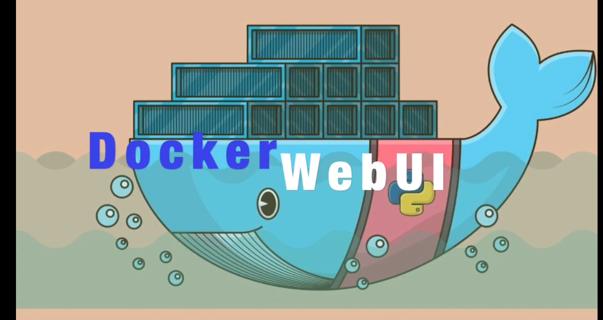

# Docker_webTools
The task is based on creating a Web Application for Docker, in which we are performing operations by giving commands using Web UI. Some of the common examples of commands that can be executed using this WebApp are:
 
👉docker images  
 👉docker ps   
 👉docker run  
 👉docker rm -f  
 👉docker images  
 

 

 
 
